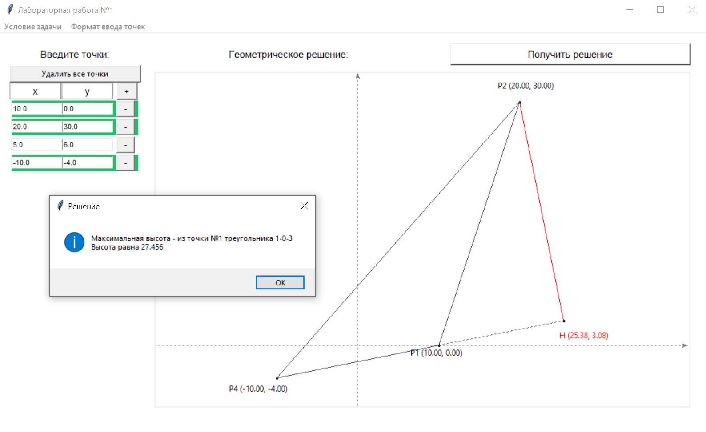

# Лабортаторная работа 1

На плоскости дано множество точек. Найти такой треугольник с вершинами в этих точках, у которого выстоа имеет максимальную длинну. Для каждого треугольника берётся та из трёх высот, длина которых максимальна. Сделать вывод в графическом режиме.

