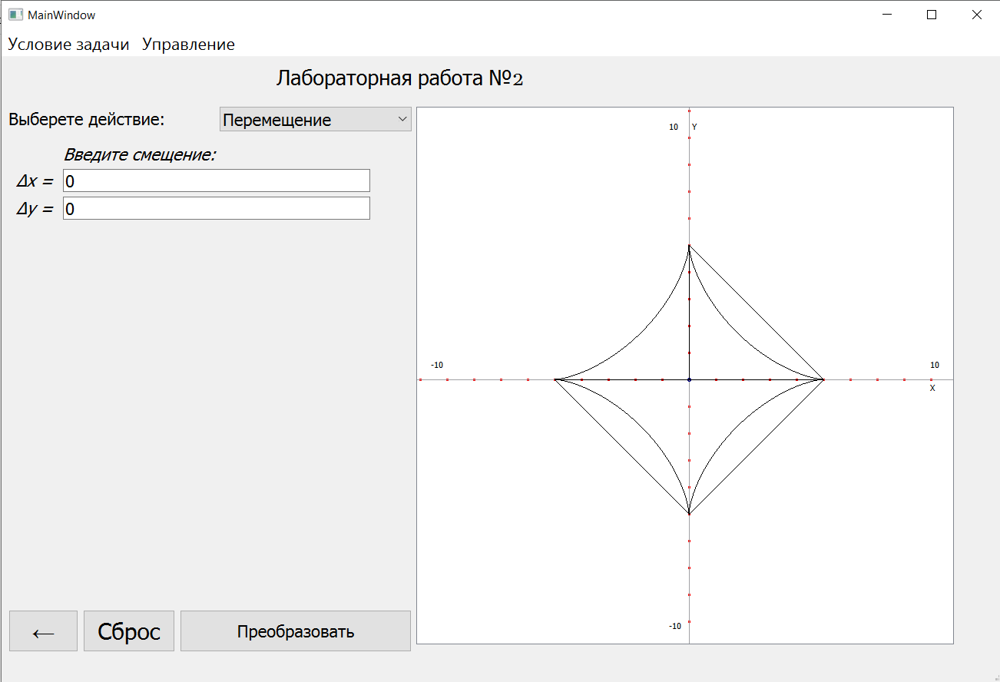

# Лабораторная работа №2

Нарисовать исходную фигуру, затем её переметить промасштабировать и повернуть. Фигура предстваляет собой прямоугольник с внутренней астроидой

**x = b * cos(t)^3**  
**y = b * sin(t)^3**  
**t - [0, 2pi]**  

